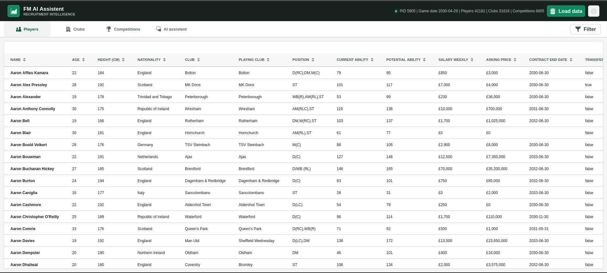
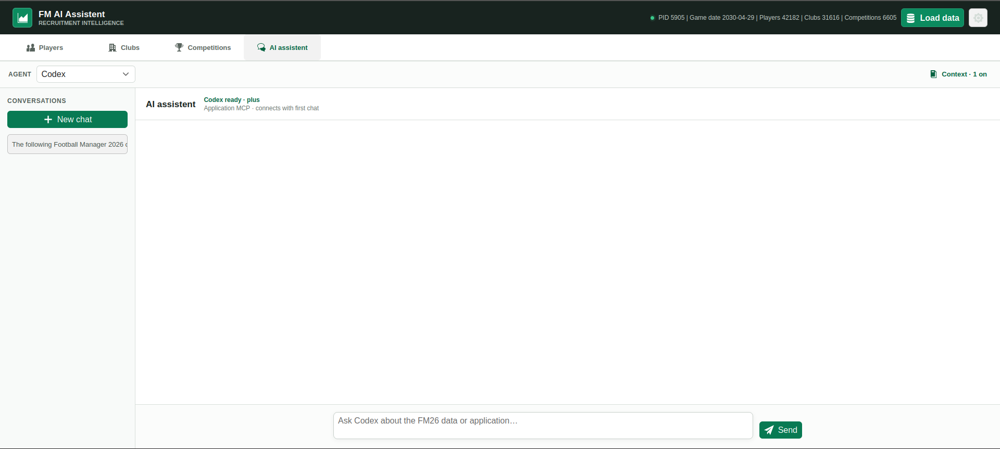
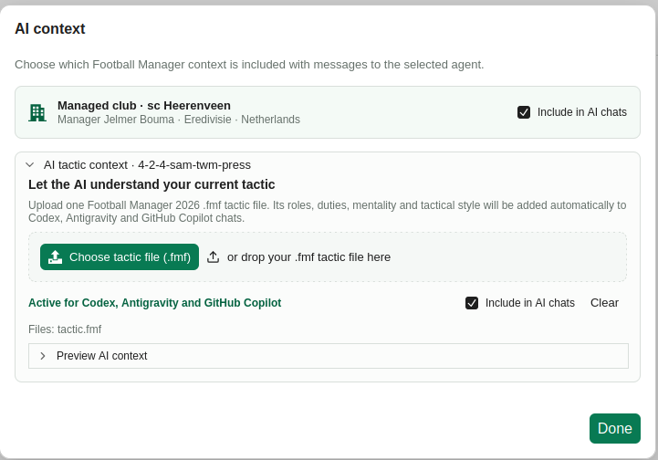

# FM AI Assistent

FM AI Assistent is a local companion app for **Football Manager 2026** on Windows 11 and Linux.

It reads your loaded FM26 save directly from memory so you can:

- search and compare players, clubs and competitions;
- inspect attributes, positions, contracts, wages and budgets;
- ask an AI assistant for recruitment, squad and tactical advice;
- give the AI extra context about your managed club and an exported `.fmf` tactic.

Your FM data and tactic file are processed locally. FM AI Assistent does not require or store an AI API key.

The assistant can also diagnose tactic-specific squad depth, compare finalists, find replacements,
model incoming and outgoing moves, and retain verified recruitment evidence between RAM refreshes.

## Install

Download the latest version from [GitHub Releases](https://github.com/JelmerBouma1985/fm-ai-assistent/releases/latest).

Choose one of the release assets:

| Download | Best for | Requirement |
|---|---|---|
| **Desktop application** | Most users | Nothing else to install |
| **Native image** | A small standalone application | Nothing else to install |
| **JAR** | Users who already have Java | Java 25 or newer |

### Desktop application (recommended)

Download the desktop application for your operating system, extract it when necessary, and run **FM AI Assistent**.

On Linux, make the downloaded launcher executable if required:

```bash
chmod +x "FM AI Assistent"
```

### Native image

Download the native image for your operating system. On Linux:

```bash
chmod +x fm-ai-assistent
./fm-ai-assistent
```

### JAR

Install Java 25 or newer, download the JAR, and run:

```bash
java -jar fm-ai-assistent.jar
```

The application is available at [http://127.0.0.1:8080](http://127.0.0.1:8080). The desktop application normally opens this page automatically.

## Use the app

1. Start Football Manager 2026 and load your save.
2. Start FM AI Assistent as the same computer user as FM26.
3. Open [http://127.0.0.1:8080](http://127.0.0.1:8080) if it did not open automatically.
4. Select **Load data**.
5. Browse the **Players**, **Clubs** and **Competitions** tabs, or open **AI assistent**.

Select **Load data** again after opening another save, changing clubs or advancing to data you want the app to refresh.



## Use the AI assistant

The embedded chat supports locally installed **Codex**, **Antigravity** and **GitHub Copilot**. You only need to install and sign in to the agent you want to use.

1. Complete the one-time setup for your chosen agent below.
2. Start FM26, load your save and select **Load data**.
3. Open **AI assistent**.
4. Choose the agent from the **Agent** list.
5. Select **Context** to control what is included with your messages.
6. Start a new chat and ask your question.



### AI context

The managed club is detected automatically when you select **Load data**.

To add your tactic, select **Context** in the AI assistant, upload the `.fmf` tactic file exported by FM26, and close the context window. The app converts the tactic into information the AI can understand.

Use the **Include in AI chats** checkboxes to enable or disable the managed-club and tactic context without removing them from the app.



### Create an FM26 player shortlist

After the agent has found and discussed transfer targets, ask it to create an importable shortlist, for example: `Create an FM26 shortlist called Young centre-backs with these players.` The agent uses each player's FM Unique ID and writes a player-shortlist `.fmf` file directly to the detected FM26 `shortlists` folder.

### Decision workflow

For faster and more reproducible answers, the agent can now use task-level tools instead of assembling every conclusion from raw player rows:

1. Check `fm26_get_data_status` and refresh stale data with `fm26_refresh_data`.
2. Diagnose depth and the two phases of the loaded tactic with `fm26_analyze_squad`.
3. Search with `fm26_transfer_shortlist` or match a known player with `fm26_find_replacements`.
4. Compare finalists by FM Unique ID with `fm26_compare_players`.
5. Record agent-enquiry or in-game evidence with `fm26_update_recruitment_case`.
6. Test the depth and financial effect of moves with `fm26_plan_squad_moves` before acting in FM26.

Decision responses include the snapshot identity. Unknown asking prices, wage demands and sale proceeds remain explicit rather than being treated as zero. The recruitment board survives RAM data refreshes so verified refusals and agreed deals continue to guide later searches.

## Set up an AI agent

FM AI Assistent uses the agent's normal local login. It does not ask for a Codex, Gemini or GitHub API key.

### Codex

1. Install the [Codex CLI](https://developers.openai.com/codex/cli/).
2. Open **AI assistent**, choose **Codex**, and use **Sign in with ChatGPT** when shown.
3. If Codex cannot see the FM26 tools, run this once in a terminal while FM AI Assistent is running:

```bash
codex mcp add fm-ai-assistent --url http://127.0.0.1:8080/mcp
```

Codex asks for approval in the app before using tools that require permission.

### Antigravity

1. Install the [Antigravity CLI](https://codelabs.developers.google.com/antigravity-cli-hands-on) (`agy`).
2. Run `agy` once in a terminal, sign in with Google and approve the workspace when requested.
3. Add FM AI Assistent to `~/.gemini/config/mcp_config.json`:

```json
{
  "mcpServers": {
    "fm-ai-assistent": {
      "serverUrl": "http://127.0.0.1:8080/mcp"
    }
  }
}
```

Antigravity cannot show an approval popup during a headless chat. Add the following FM26 tool permissions to the existing `permissions.allow` list in `~/.gemini/antigravity-cli/settings.json`:

```json
{
  "permissions": {
    "allow": [
      "mcp(fm-ai-assistent/fm26_find_clubs)",
      "mcp(fm-ai-assistent/fm26_find_players)",
      "mcp(fm-ai-assistent/fm26_get_club_context)",
      "mcp(fm-ai-assistent/fm26_get_player_details)",
      "mcp(fm-ai-assistent/fm26_get_role_attributes)",
      "mcp(fm-ai-assistent/fm26_transfer_shortlist)",
      "mcp(fm-ai-assistent/fm26_get_data_status)",
      "mcp(fm-ai-assistent/fm26_analyze_squad)",
      "mcp(fm-ai-assistent/fm26_compare_players)",
      "mcp(fm-ai-assistent/fm26_find_replacements)",
      "mcp(fm-ai-assistent/fm26_plan_squad_moves)",
      "mcp(fm-ai-assistent/fm26_get_recruitment_board)",
      "mcp(fm-ai-assistent/fm26_update_recruitment_case)",
      "mcp(fm-ai-assistent/fm26_refresh_data)",
      "mcp(fm-ai-assistent/fm26_create_shortlist_file)"
    ]
  }
}
```

If the file already contains settings or permissions, merge these entries into it instead of replacing the complete file. `fm26_create_shortlist_file` writes one new `.fmf` file, `fm26_update_recruitment_case` writes local decision evidence, and `fm26_refresh_data` replaces the app's local data snapshot. None of these tools writes to the FM26 process; the other listed tools are read-only.

### GitHub Copilot

1. Install [GitHub Copilot CLI](https://docs.github.com/en/copilot/how-tos/copilot-cli/cli-getting-started).
2. Sign in once:

```bash
copilot login
```

3. Start FM AI Assistent and add its MCP server:

```bash
copilot mcp add --transport http fm-ai-assistent http://127.0.0.1:8080/mcp
```

Do not add it again if `copilot mcp list` already shows `fm-ai-assistent`. Copilot permission prompts appear inside the app. For the app's read-only FM26 tools, you can choose **Always allow this MCP tool**.

## Troubleshooting

### No FM26 data is found

- Make sure FM26 is running and a save is fully loaded.
- Run FM26 and FM AI Assistent as the same computer user.
- On Windows, use the same administrator level for both applications.
- Select **Load data** again.

### An AI agent is unavailable

Install the selected CLI, complete its normal login, and restart FM AI Assistent so it can find the new command.

### The AI cannot use FM26 tools

- Keep FM AI Assistent running while using the chat.
- Check that the agent's MCP server address is `http://127.0.0.1:8080/mcp`.
- For Antigravity, check that the server name and permission rules both use `fm-ai-assistent`.

### The app does not open

Open [http://127.0.0.1:8080](http://127.0.0.1:8080) manually. Only one copy of FM AI Assistent can use port 8080 at a time.

Desktop application logs are stored in:

```text
~/.fm-ai-assistent/fm-ai-assistent.log
```

## Privacy and safety

FM AI Assistent listens only on your own computer by default. Keep it local: enabled AI agents may access FM26 data, local files and tools after receiving the required permission.
